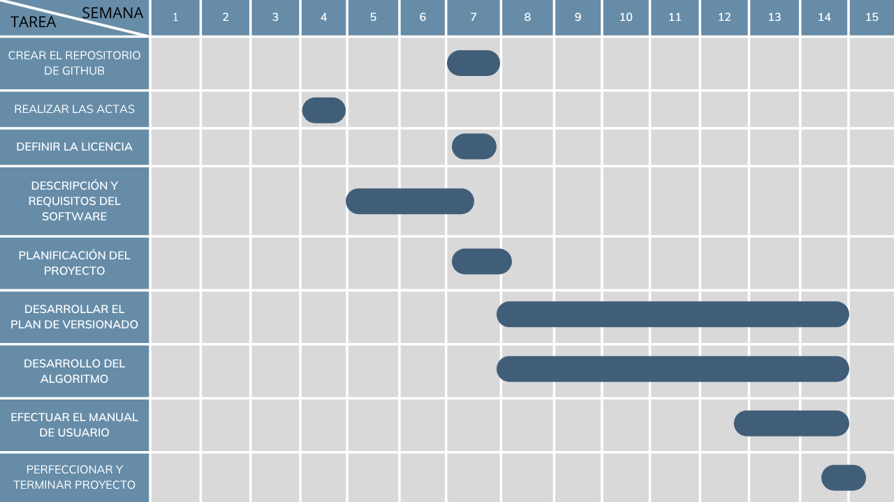

<h1 align="center">MJ LEDGER</h1>

MJ LEDGER es una aplicación desarrollada en Python que permite gestionar el préstamo de artículos de manera organizada, facilitando el registro, control y seguimiento de la información, con el objetivo de evitar pérdidas y mejorar la administración de los recursos.

## PARTICIPANTES

- **Dana Moreno:** Tengo 21 años y vivo en Chigorodó Antioquia soy estudiante de Ingeniería Industrial, pertenezco a la seccional Turbo y actualmente estoy en quinto semestre donde he fortalecido mis conocimientos en análisis de sistemas, gestión de procesos y uso de herramientas cuantitativas. Soy una persona creativa y muy activa, me gusta recibir y brindar conocimiento, me considero muy organizada y aplicada en todo lo que me propongo. 

- **Valentina Ramírez:** Tengo 18 años y vivo en El Santuario - Antioquia, estudio Ingeniería Industrial, pertenezco a la seccional Carmen de Vivoral y actualmente voy en tercer semestre. Soy una persona curiosa, persistente y colaborativa. Me caracterizo por tener una gran capacidad de organización, claridad en la comunicación y creatividad para encontrar soluciones prácticas. Disfruto aprender cosas nuevas y analizar detalles con precisión, siempre buscando mejorar y aportar valor en lo que hago. Me gusta combinar la exactitud con la estética, y busco que mis resultados sean claros y atractivos.

## REPORTE DE VISIÓN

El sistema **MJ LEDGER** es una aplicación desarrollada en Python que tiene como propósito gestionar de manera eficiente el préstamo de artículos, permitiendo el registro, control y seguimiento de usuarios, ítems y transacciones asociadas. Este sistema surge como solución a la problemática presentada por MJ, quien enfrenta dificultades para recordar a quién ha prestado sus objetos y en qué condiciones se encuentran, generando desorganización y pérdida de información.

El software está diseñado para centralizar la información de los préstamos, permitiendo registrar usuarios con sus datos, gestionar un inventario de artículos categorizados y controlar el ciclo completo de préstamo y devolución. Además, incorpora funcionalidades adicionales como la generación de certificados de devolución y facturación automática en caso de incumplimiento en los tiempos establecidos, lo que fortalece el control sobre los recursos.

El objetivo principal del sistema es mejorar la organización y trazabilidad de los artículos prestados, reduciendo errores humanos y facilitando la toma de decisiones mediante información clara y estructurada. De igual forma, busca ofrecer una herramienta práctica, confiable y accesible que pueda ser utilizada en entornos donde se requiera llevar un control detallado de préstamos.

Entre los beneficios del sistema se destacan la optimización del tiempo en la gestión de información, la reducción de pérdidas o confusiones sobre los artículos, el acceso a reportes administrativos y la posibilidad de mantener un historial completo de las operaciones realizadas. De esta manera, MJ LEDGER se posiciona como una solución integral para la administración de préstamos, adaptada a las necesidades planteadas en el problema.

## ESPECIFICACIÓN DE REQUISITOS
El sistema **MJ LEDGER** define un conjunto de requisitos que permiten gestionar de manera estructurada el préstamo de artículos, asegurando el control de usuarios, inventario, préstamos, devoluciones y procesos asociados como certificaciones y facturación.

### REQUISITOS FUNCIONALES
1. El sistema debe permitir el registro de usuarios, validando nombre, apellido, documento, correo electrónico y tiempo de préstamo permitido.
2. El sistema debe permitir registrar artículos, incluyendo nombre, categoría, precio de compra, identificador único y estado del ítem.
3. El sistema debe permitir realizar préstamos únicamente a usuarios previamente registrados, asociando el ítem y la fecha correspondiente.
4. El sistema debe validar que un ítem esté disponible antes de ser prestado.
5. El sistema debe permitir registrar devoluciones únicamente de préstamos activos.
6. El sistema debe generar un certificado de devolución cuando un artículo es retornado dentro del tiempo establecido.
7. El sistema debe generar una factura de venta cuando un artículo supere el tiempo máximo de préstamo (30 días), incluyendo el cálculo de impuestos.
8. El sistema debe permitir consultar el estado general de los préstamos, mostrando información organizada por tiempo.
9. El sistema debe almacenar la información en archivos para su posterior consulta.
10. El sistema debe permitir el acceso a un módulo de administrador mediante validación de usuario y contraseña.
11. El sistema debe generar reportes administrativos, incluyendo:
    - Total de préstamos
    - Total de devoluciones
    - Total de ventas
    - Total de pagos
    - Lista de usuarios
    - Usuarios con mayor y menor número de préstamos

### REQUISITOS NO FUNCIONALES
1. **Usabilidad:** El sistema debe contar con un menú claro y organizado que facilite la interacción del usuario.
2. **Rendimiento:** El sistema debe procesar las operaciones de manera rápida y eficiente.
3. **Fiabilidad:** El sistema debe garantizar que los datos almacenados sean correctos y consistentes.
4. **Seguridad:** El sistema debe restringir el acceso al módulo administrativo mediante credenciales válidas.
5. **Portabilidad:** El sistema debe ejecutarse en cualquier entorno compatible con Python.
6. **Mantenibilidad:** El código debe estar bien estructurado utilizando buenas prácticas de programación.
7. **Compatibilidad:** El sistema debe funcionar en diferentes sistemas operativos sin afectar su funcionamiento.

## PLAN DE PROYECTO

### DIAGRAMA DE GANTT

El cronograma del proyecto se organiza en un periodo de 15 semanas, distribuyendo las actividades de manera progresiva y estratégica. En las primeras semanas se abordan tareas de preparación y organización, como la elaboración de actas y la definición de requisitos, que permiten establecer una base sólida para el desarrollo posterior.

La semana 7 marca un punto clave, ya que se concentran actividades fundamentales como la creación del repositorio en GitHub, la definición de la licencia y la planificación general del proyecto. Estas acciones garantizan que el equipo cuente con lineamientos claros y un entorno de trabajo estructurado.

Entre la semana 8 y la 14 se desarrolla el núcleo técnico del proyecto: el plan de versionado, la construcción del algoritmo y la elaboración del manual de usuario. Esta fase refleja el mayor esfuerzo del equipo, pues combina la implementación práctica con la documentación necesaria para asegurar la usabilidad del producto.

Finalmente, la semana 15 se dedica a la perfección y cierre del proyecto, consolidando los resultados y asegurando que se cumplan los objetivos planteados. Este esquema permite visualizar la secuencia lógica de las tareas, la interdependencia entre ellas y el compromiso del equipo en cada etapa.

### PRESUPUESTO DEL PROYECTO

| **Estudiante** | **Horas aportadas**| **Equivalencia en SMLV** | **Valor en pesos (2026)** |
|--------------|-----------------|----------------------|------------------------------------|
| Dana | 50 horas | 1 SMLV | $1.750.905 |
| Valentina | 50 horas | 1 SMLV | $1.750.905 |
| **Total** | **100 horas** | **2 SMLV** | **$3.501.810** |

El presupuesto se calcula en tiempo de práctica de formación, no en dinero directo. Cada estudiante dedica **50 horas** de trabajo, lo que en conjunto suma **100 horas** para el equipo de dos integrantes. Según la equivalencia establecida en el ejercicio,**50 horas corresponden a 1 SMLV,** por lo tanto el total de **100 horas equivale a 2 SMLV.**

En términos monetarios, tomando como referencia el Salario Mínimo Legal Vigente en Colombia para 2026, el valor de un SMLV es de **$1.750.905.** Así, el presupuesto total del proyecto corresponde a **$3.501.810,** representado en tiempo de práctica profesional.

Este cálculo refleja el esfuerzo académico y práctico invertido por los estudiantes, y permite valorar el proyecto en función del tiempo de dedicación, manteniendo coherencia con el enfoque formativo planteado.

## LICENCIA DEL SOFTWARE

Este proyecto se distribuye bajo la licencia MIT, la cual permite el uso, copia, modificación y distribución del software.  
Para más información, consulte el archivo [LICENSE](LICENSE).

  
